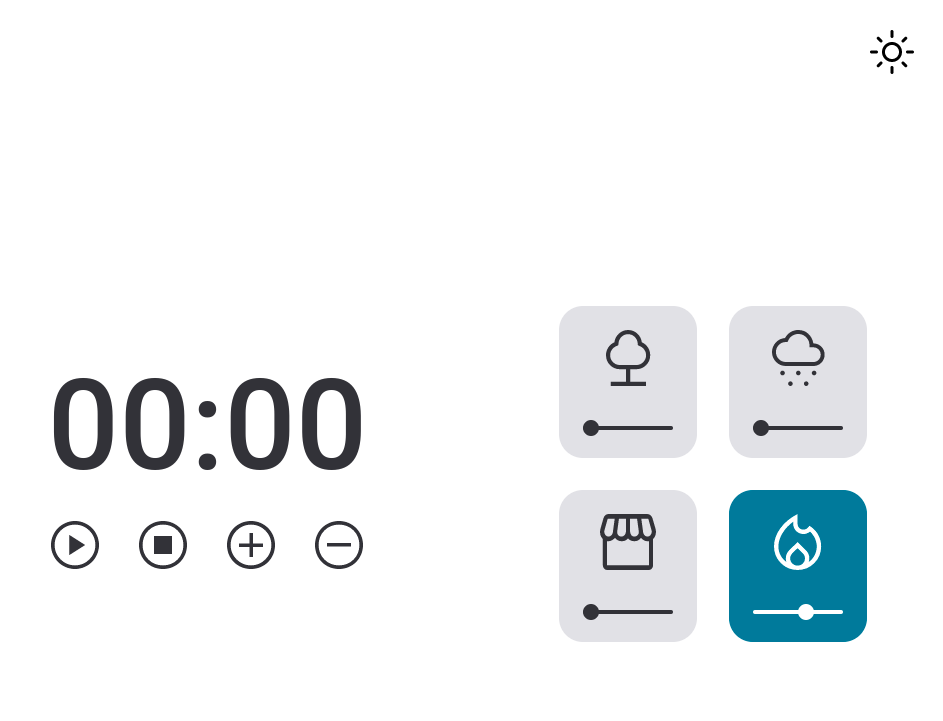
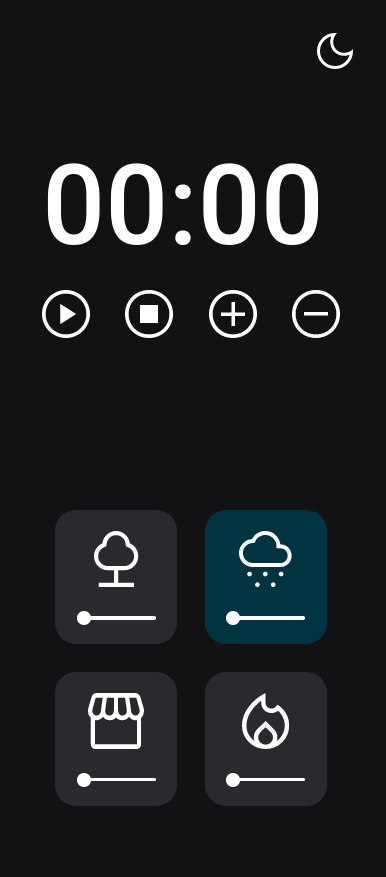

# Desafio 02 - Stage 05, Explorer.

Este é o projeto do último desafio do Stage 05 do programa Explorer da [RocketSeat](https://rocketseat.com.br/).

## Índice

- [Projeto](#FocusTimerV2_DarkMode)
  - [Screenshots](#screenshots)
  - [Tecnologias Utilizadas](#tecs)
  - [Autor](#autor)

## FocusTimerV2_DarkMode

Este projeto é o resultado do conhecimento adquirido no programa Explorer, até o momento.  

### Páginas

Projeto Git - [Projeto](https://loreancarlos.github.io/FocusTimerV2_DarkMode/)

### O Desafio

- Reproduzir o layout completo de uma página.
    - Adicionar todos os elementos do projeto mantendo suas proporções e características.
    - Utilizar tags semânticas para melhor acessibilidade.
    - Modelar o layout de forma responsiva para se adequar a todos os tamanhos de dispositivos. 
    - Adicionar animações para adicionar interatividade ao Layout.
    - Realizar a construção das funcionalidades com a linguagem JavaScript.
    - Realizar a programação do Java Script de forma Modular.
    - Adicionar novas funcionalidades como controlador de volume e alteração de propriedades conforme a seleção do tema desejado.
- Obs: As especificações do layout foram disponibilizadas pelo Figma.

### Screenshots

## Tecs

Tecnologias

- HTML
- CSS
- JavaScript

Outras

- HTML5 - Tags Semânticas
- CSS - Display Flexbox e Grid - @Media Queries
- JavaScript - Organização Modular - Função Recursiva

## Autor

- LinkedIn - [Lorean Carlos](https://www.linkedin.com/in/lorean-carlos-fernandes-soares-03220121a/)
- Rocketseat - [Perfil](https://app.rocketseat.com.br/me/loreancarlos)